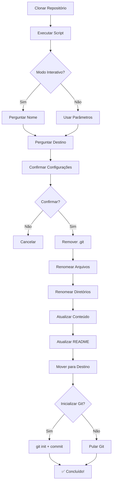

# 🚀 Product.Template - Setup Scripts

Scripts automatizados para configuração inicial do template após clonar o repositório.

---

## 📋 O que os Scripts Fazem?

Os scripts de setup automatizam completamente a transformação do template no seu projeto:

✅ Remove a pasta `.git` do template  
✅ Renomeia arquivos `.sln` e `.csproj`  
✅ Renomeia diretórios (pastas do projeto)  
✅ Atualiza namespaces em todos os arquivos `.cs`  
✅ Atualiza referências em arquivos de configuração (`.json`, `.yml`, `.md`)  
✅ Cria um novo `README.md` personalizado  
✅ Move o projeto para o diretório de destino escolhido  
✅ Inicializa um novo repositório Git (opcional)  

---

## 🪟 Windows (PowerShell)

### **Pré-requisitos**
- PowerShell 5.1+ (já vem no Windows 10/11)
- .NET 10 SDK instalado
- Git (se quiser inicializar repositório)

### **Uso Básico**

```powershell
# 1. Clone o template
git clone https://github.com/luiszkm/Product.Template.git
cd Product.Template

# 2. Execute o script (modo interativo)
.\setup.ps1

# Você será perguntado:
# - Nome do novo projeto (ex: MyCompany.EcommerceApi)
# - Caminho de destino (ex: C:\Projects)
```

### **Uso Avançado**

```powershell
# Especificar nome e caminho diretamente
.\setup.ps1 -ProjectName "Contoso.OrderApi" -OutputPath "C:\Dev\Projects"

# Pular inicialização do Git
.\setup.ps1 -ProjectName "MyProject" -SkipGitInit

# Modo verboso (ver detalhes de cada arquivo processado)
.\setup.ps1 -Verbose
```

### **Exemplo Completo**

```powershell
# Clone
git clone https://github.com/luiszkm/Product.Template.git
cd Product.Template

# Execute com parâmetros
.\setup.ps1 -ProjectName "AcmeCorp.ProductApi" -OutputPath "C:\Users\MeuUsuario\Projects"

# Resultado:
# └── C:\Users\MeuUsuario\Projects\
#     └── AcmeCorp.ProductApi\
#         ├── src\
#         │   ├── Api\
#         │   │   └── AcmeCorp.ProductApi.csproj
#         │   ├── Core\
#         │   └── Shared\
#         ├── tests\
#         ├── AcmeCorp.ProductApi.sln
#         └── README.md
```

---

## 🐧 Linux / macOS (Bash)

### **Pré-requisitos**
- Bash 4.0+
- .NET 10 SDK instalado
- Git (se quiser inicializar repositório)

### **Preparação**

```bash
# Clone o template
git clone https://github.com/luiszkm/Product.Template.git
cd Product.Template

# Dar permissão de execução
chmod +x setup.sh
```

### **Uso Básico**

```bash
# Modo interativo
./setup.sh

# Você será perguntado:
# - Nome do novo projeto (ex: MyCompany.EcommerceApi)
# - Caminho de destino (ex: /home/user/projects)
```

### **Uso Avançado**

```bash
# Especificar nome e caminho diretamente
./setup.sh -n "Contoso.OrderApi" -o "/home/user/projects"

# Pular inicialização do Git
./setup.sh -n "MyProject" --skip-git

# Modo verboso
./setup.sh -v

# Ver ajuda
./setup.sh --help
```

### **Exemplo Completo**

```bash
# Clone
git clone https://github.com/luiszkm/Product.Template.git
cd Product.Template

# Execute com parâmetros
./setup.sh -n "AcmeCorp.ProductApi" -o "~/projects"

# Resultado:
# └── ~/projects/
#     └── AcmeCorp.ProductApi/
#         ├── src/
#         │   ├── Api/
#         │   │   └── AcmeCorp.ProductApi.csproj
#         │   ├── Core/
#         │   └── Shared/
#         ├── tests/
#         ├── AcmeCorp.ProductApi.sln
#         └── README.md
```

---

## 📝 Parâmetros

### PowerShell (`.ps1`)

| Parâmetro | Descrição | Exemplo |
|-----------|-----------|---------|
| `-ProjectName` | Nome do novo projeto | `"MyCompany.Api"` |
| `-OutputPath` | Caminho de destino | `"C:\Projects"` |
| `-SkipGitInit` | Não inicializar Git | `-SkipGitInit` |
| `-Verbose` | Modo verboso | `-Verbose` |

### Bash (`.sh`)

| Parâmetro | Descrição | Exemplo |
|-----------|-----------|---------|
| `-n, --name` | Nome do novo projeto | `"MyCompany.Api"` |
| `-o, --output` | Caminho de destino | `"/home/user/projects"` |
| `--skip-git` | Não inicializar Git | `--skip-git` |
| `-v, --verbose` | Modo verboso | `-v` |
| `-h, --help` | Exibir ajuda | `-h` |

---

## ✅ Validações

Os scripts validam automaticamente:

- ✅ Nome do projeto (apenas `A-Z`, `a-z`, `0-9`, `.`, `_`, `-`)
- ✅ Existência do arquivo `Product.Template.sln` (garante que você está no diretório correto)
- ✅ Conflito de diretórios (pergunta se deseja sobrescrever)
- ✅ Permissões de escrita no diretório de destino

---

## 🎯 Fluxo de Execução



---

## 🔧 Troubleshooting

### **Erro: "Execution Policy"** (PowerShell)

```powershell
# Erro:
# setup.ps1 cannot be loaded because running scripts is disabled

# Solução: Permitir execução temporariamente
Set-ExecutionPolicy -Scope Process -ExecutionPolicy Bypass

# Execute o script novamente
.\setup.ps1
```

### **Erro: "Permission Denied"** (Linux/Mac)

```bash
# Erro:
# bash: ./setup.sh: Permission denied

# Solução: Dar permissão de execução
chmod +x setup.sh

# Execute novamente
./setup.sh
```

### **Erro: "Product.Template.sln not found"**

Certifique-se de estar no diretório raiz do template:

```bash
# Verificar estrutura
ls -la

# Deve ter:
# - Product.Template.sln
# - src/
# - tests/
# - setup.ps1
# - setup.sh
```

### **Erro: "sed: command not found"** (Windows Git Bash)

Use PowerShell ao invés de Git Bash:

```powershell
# Execute no PowerShell nativo
.\setup.ps1
```

---

## 📂 Estrutura Antes vs Depois

### **Antes (Template Original)**

```
Product.Template/
├── .git/
├── src/
│   ├── Api/
│   │   └── Product.Template.Api.csproj
│   ├── Core/
│   │   ├── Identity/
│   │   │   ├── Product.Template.Core.Identity.Domain/
│   │   │   └── Product.Template.Core.Identity.Application/
│   └── Shared/
│       └── Product.Template.Kernel.*/
├── tests/
├── Product.Template.sln
└── README.md (template genérico)
```

### **Depois (Projeto Personalizado)**

```
MyCompany.ProductApi/        ← Novo diretório
├── .git/                    ← Novo repositório Git
├── src/
│   ├── Api/
│   │   └── MyCompany.ProductApi.csproj  ← Renomeado
│   ├── Core/
│   │   ├── Identity/
│   │   │   ├── MyCompany.ProductApi.Core.Identity.Domain/  ← Renomeado
│   │   │   └── MyCompany.ProductApi.Core.Identity.Application/
│   └── Shared/
│       └── MyCompany.ProductApi.Kernel.*/  ← Renomeado
├── tests/
├── MyCompany.ProductApi.sln  ← Renomeado
└── README.md                 ← Personalizado
```

---

## 🚀 Próximos Passos Após o Setup

```bash
# 1. Navegue até o projeto
cd /caminho/do/seu/projeto

# 2. Restaurar pacotes
dotnet restore

# 3. Compilar
dotnet build

# 4. Configurar User Secrets
cd src/Api
dotnet user-secrets set "Jwt:Secret" "sua-chave-secreta-minimo-32-caracteres"
dotnet user-secrets set "MicrosoftAuth:ClientId" "seu-client-id"
dotnet user-secrets set "MicrosoftAuth:ClientSecret" "seu-client-secret"

# 5. Executar
dotnet run

# 6. Acessar Scalar API Documentation
# https://localhost:7254/scalar/v1
```

---

## 📚 Documentação Complementar

Após executar o setup, consulte:

- **`README.md`** - Visão geral do seu projeto
- **`docs/MICROSOFT_AUTH_SETUP.md`** - Como configurar autenticação Microsoft
- **`docs/AUTHENTICATION_EXTENSIBILITY.md`** - Como adicionar novos providers (Google, Facebook, etc.)

---

## 🤝 Contribuindo

Encontrou algum problema ou tem sugestões? Abra uma issue:  
👉 https://github.com/luiszkm/Product.Template/issues

---

## 📄 Licença

Este template é open source. Veja `LICENSE` para mais detalhes.

---

**Criado com ❤️ para acelerar o desenvolvimento de APIs .NET**
