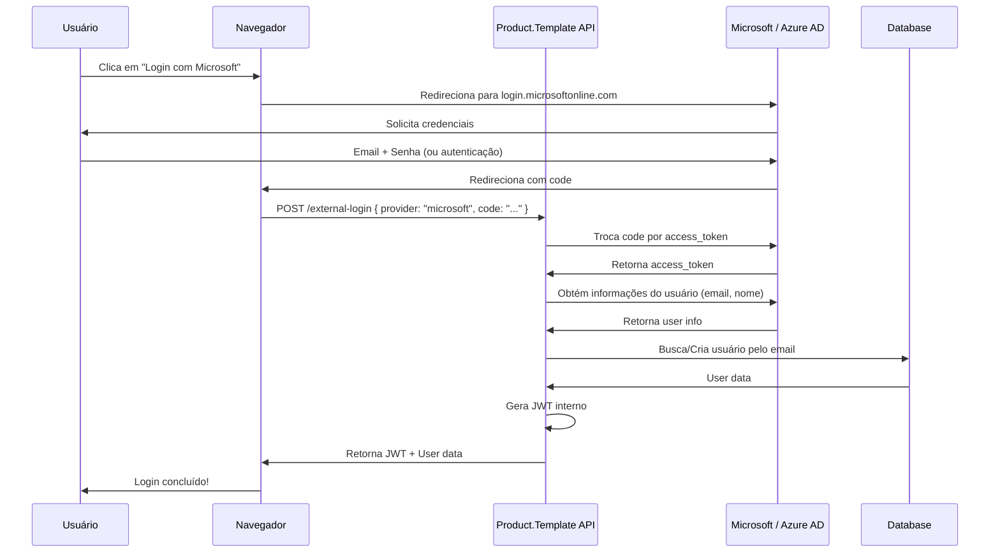

# 🔐 Configuração de Autenticação Microsoft

Guia completo para configurar autenticação via Microsoft / Azure AD / Entra ID no Product.Template.

## 📋 Pré-requisitos

- Conta Microsoft (pessoal ou corporativa)
- Acesso ao [Azure Portal](https://portal.azure.com/)
- .NET 10 SDK instalado
- Projeto Product.Template configurado

---

## 🚀 Passo a Passo

### 1️⃣ Registrar Aplicação no Azure Portal

1. Acesse [Azure Portal](https://portal.azure.com/)
2. Navegue até **Microsoft Entra ID** (menu lateral esquerdo)
3. Clique em **App registrations** (Registros de aplicativos)
4. Clique em **+ New registration** (Novo registro)

### 2️⃣ Preencher Informações da Aplicação

- **Name**: `Product.Template.Api` (ou nome de sua preferência)
- **Supported account types**: 
  - ✅ `Accounts in any organizational directory and personal Microsoft accounts`
  - Permite login com contas pessoais (@outlook.com, @hotmail.com) e corporativas
- **Redirect URI**:
  - Tipo: `Web`
  - URI: `https://localhost:7254/api/v1/identity/external-callback`
  


Clique em **Register** (Registrar)

### 3️⃣ Obter Application (Client) ID

Após o registro, você será redirecionado para a página Overview da aplicação.

1. Copie o **Application (client) ID**
   - Exemplo: `a1b2c3d4-e5f6-7890-abcd-ef1234567890`
2. Copie o **Directory (tenant) ID** (opcional, use "common" para multi-tenant)


### 4️⃣ Criar Client Secret

1. No menu lateral, clique em **Certificates & secrets** (Certificados e segredos)
2. Na aba **Client secrets**, clique em **+ New client secret**
3. Preencha:
   - **Description**: `Product.Template Development`
   - **Expires**: `24 months` (recomendado para desenvolvimento)
4. Clique em **Add**
5. ⚠️ **IMPORTANTE**: Copie o **Value** imediatamente!
   - Este valor **não será mostrado novamente**
   - Exemplo: `abc123~XyZ789~def456`


### 5️⃣ Configurar Redirect URIs Adicionais (Opcional)

Para ambientes de homologação/produção:

1. Vá em **Authentication** (Autenticação)
2. Em **Platform configurations**, clique em **Add a platform**
3. Selecione **Web**
4. Adicione URIs adicionais:
   ```
   https://localhost:7254/api/v1/identity/external-callback
   https://api-staging.exemplo.com/api/v1/identity/external-callback
   https://api.exemplo.com/api/v1/identity/external-callback
   ```

---

## ⚙️ Configuração no Projeto

### 1️⃣ Configurar User Secrets (Desenvolvimento)

**Nunca commite Client Secrets no código!** Use User Secrets:

```bash
cd src/Api

# Inicializar User Secrets
dotnet user-secrets init

# Configurar Client ID
dotnet user-secrets set "MicrosoftAuth:ClientId" "a1b2c3d4-e5f6-7890-abcd-ef1234567890"

# Configurar Client Secret
dotnet user-secrets set "MicrosoftAuth:ClientSecret" "abc123~XyZ789~def456"

# Verificar
dotnet user-secrets list
```

### 2️⃣ Atualizar appsettings.Development.json

```json
{
  "MicrosoftAuth": {
    "Enabled": true,
    "ClientId": "override-by-user-secrets",
    "ClientSecret": "override-by-user-secrets",
    "TenantId": "common",
    "RedirectUri": "https://localhost:7254/api/v1/identity/external-callback",
    "Scopes": "openid profile email"
  }
}
```

### 3️⃣ Configurar Produção (Azure App Service)

Use **Application Settings** no Azure:

```bash
az webapp config appsettings set \
  --name my-app \
  --resource-group my-rg \
  --settings \
    MicrosoftAuth__ClientId="a1b2c3d4-e5f6-7890-abcd-ef1234567890" \
    MicrosoftAuth__ClientSecret="abc123~XyZ789~def456"
```

Ou via Azure Key Vault:

```json
{
  "MicrosoftAuth": {
    "ClientId": "@Microsoft.KeyVault(SecretUri=https://myvault.vault.azure.net/secrets/MicrosoftClientId/)",
    "ClientSecret": "@Microsoft.KeyVault(SecretUri=https://myvault.vault.azure.net/secrets/MicrosoftClientSecret/)"
  }
}
```

---

## 🧪 Testar Autenticação

### 1️⃣ Iniciar a API

```bash
cd src/Api
dotnet run
```

### 2️⃣ Acessar Scalar

Abra: `https://localhost:7254/scalar/v1`

### 3️⃣ Testar Endpoint de Provedores

```http
GET https://localhost:7254/api/v1/identity/providers
```

**Resposta esperada:**
```json
{
  "providers": ["jwt", "microsoft"],
  "count": 2
}
```

### 4️⃣ Testar Login via Microsoft

#### Opção A: Via Scalar UI

1. No Scalar, vá até o endpoint `POST /api/v1/identity/external-login`
2. Clique em **Try It Out**
3. Preencha o body:
   ```json
   {
     "provider": "microsoft",
     "code": "obter-via-fluxo-oauth2",
     "redirectUri": "https://localhost:7254/api/v1/identity/external-callback"
   }
   ```

#### Opção B: Via curl

**1. Obter código de autorização (abra no navegador):**

```
https://login.microsoftonline.com/common/oauth2/v2.0/authorize?client_id=a1b2c3d4-e5f6-7890-abcd-ef1234567890&response_type=code&redirect_uri=https://localhost:7254/api/v1/identity/external-callback&scope=openid%20profile%20email
```

**2. Após aprovação, você será redirecionado para:**

```
https://localhost:7254/api/v1/identity/external-callback?code=0.AX0A8q3...
```

**3. Copie o valor do parâmetro `code` e faça a requisição:**

```bash
curl -X POST https://localhost:7254/api/v1/identity/external-login \
  -H "Content-Type: application/json" \
  -d '{
    "provider": "microsoft",
    "code": "0.AX0A8q3...",
    "redirectUri": "https://localhost:7254/api/v1/identity/external-callback"
  }'
```

**4. Resposta esperada:**

```json
{
  "accessToken": "eyJhbGciOiJIUzI1NiIsInR5cCI6IkpXVCJ9...",
  "tokenType": "Bearer",
  "expiresIn": 3600,
  "user": {
    "id": "3fa85f64-5717-4562-b3fc-2c963f66afa6",
    "email": "usuario@outlook.com",
    "firstName": "João",
    "lastName": "Silva",
    "lastLoginAt": "2026-01-14T15:30:00Z",
    "roles": ["User"]
  }
}
```

---

## 🔒 Segurança

### ✅ Boas Práticas

1. **User Secrets em Dev**: ✅ Nunca commite Client Secrets
2. **HTTPS Obrigatório**: ✅ Sempre use HTTPS em produção
3. **Rotate Secrets**: 🔄 Troque Client Secrets periodicamente (a cada 6-12 meses)
4. **Scope Mínimo**: ⚡ Solicite apenas scopes necessários (`openid profile email`)
5. **Validação de Token**: ✅ Sempre valide tokens recebidos

### ❌ Evite

- ❌ Commitar Client Secrets no Git
- ❌ Usar HTTP em produção
- ❌ Solicitar scopes desnecessários
- ❌ Armazenar tokens sem criptografia
- ❌ Reutilizar mesmos Client IDs entre ambientes

---

## 🐛 Troubleshooting

### Erro: "Redirect URI mismatch"

**Causa**: O Redirect URI configurado no Azure não corresponde ao enviado na requisição.

**Solução**:
1. Verifique se o URI no Azure está correto
2. Certifique-se de usar **exatamente** o mesmo URI (case-sensitive)
3. Não use trailing slashes (`/`) no final

### Erro: "invalid_client"

**Causa**: Client ID ou Client Secret incorretos.

**Solução**:
1. Verifique se o Client ID está correto
2. Recrie o Client Secret se necessário
3. Confirme que o secret não expirou

### Erro: "AADSTS700016: Application not found"

**Causa**: Application (client) ID não existe ou está incorreto.

**Solução**:
1. Verifique o Client ID no Azure Portal
2. Certifique-se de estar no tenant correto

### Erro: "User not found after Microsoft login"

**Causa**: Usuário não existe no banco de dados local.

**Comportamento Esperado**:
- O sistema **automaticamente cria** um novo usuário
- Email é auto-confirmado para providers confiáveis
- Senha é gerada aleatoriamente (usuário não pode logar via JWT)

---

## 📊 Logs

### Habilitar Logs Detalhados

Em `appsettings.Development.json`:

```json
{
  "Serilog": {
    "MinimumLevel": {
      "Default": "Debug",
      "Override": {
        "Kernel.Infrastructure.Security": "Debug",
        "Product.Template.Core.Identity": "Debug"
      }
    }
  }
}
```

### Exemplos de Logs

**Login bem-sucedido:**
```
[15:30:00 INF] Autenticação Microsoft bem-sucedida para usuário usuario@outlook.com
[15:30:00 INF] Novo usuário criado via autenticação externa: usuario@outlook.com, Provider: microsoft
[15:30:01 INF] Autenticação externa bem-sucedida para usuário: a1b2c3d4-..., Provider: microsoft
```

**Falha de autenticação:**
```
[15:30:00 ERR] Erro ao obter token da Microsoft. Status: 400, Erro: {"error":"invalid_grant"}
[15:30:00 WRN] Falha na autenticação externa: Authorization code expirado ou inválido
```

---

## 🔄 Fluxo Completo



---

## 📚 Recursos Adicionais

- [Microsoft Identity Platform Documentation](https://learn.microsoft.com/en-us/entra/identity-platform/)
- [Quickstart: Register an app](https://learn.microsoft.com/en-us/entra/identity-platform/quickstart-register-app)
- [OAuth 2.0 authorization code flow](https://learn.microsoft.com/en-us/entra/identity-platform/v2-oauth2-auth-code-flow)
- [Microsoft Graph API](https://learn.microsoft.com/en-us/graph/overview)

---

## 📝 Checklist de Configuração

- [ ] Aplicação registrada no Azure Portal
- [ ] Application (client) ID copiado
- [ ] Client Secret criado e copiado
- [ ] Redirect URIs configurados
- [ ] User Secrets configurados localmente
- [ ] `MicrosoftAuth:Enabled` = `true` no appsettings
- [ ] Endpoint `/providers` retorna "microsoft"
- [ ] Teste de login via Microsoft realizado com sucesso
- [ ] Logs de autenticação verificados

---

**Última atualização:** 2026-01-14  
**Versão:** 1.0.0  
**Autor:** Luis Soares
