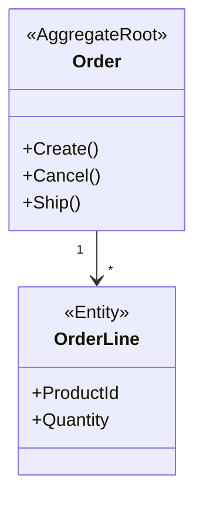

# Module Designer Agent — Resumo Executivo

> Agente especializado em design de módulos DDD criado com sucesso.

---

## ✅ O que foi criado

### 1. **Agente Principal** (16 KB)
**Arquivo:** `.github/agents/module-designer.agent.md`

**Capacidades:**
- Conduz mini Event Storming (eventos, comandos, queries, policies)
- Desenha Bounded Context Canvas completo
- Define aggregates com invariantes explícitos
- Especifica entidades, value objects, domain events
- Mapeia event handlers (policies)
- Gera estrutura de pastas e checklist de implementação
- Valida design contra regras DDD

**Processo em 5 fases:**
1. Descoberta do Domínio (Event Storming)
2. Bounded Context Canvas
3. Design de Aggregates
4. Design de Entidades e Value Objects
5. Design de Eventos e Policies

---

### 2. **Instruções Complementares** (8.3 KB)
**Arquivo:** `.github/instructions/module-design.instructions.md`

**Conteúdo:**
- Processo obrigatório de design antes de codar
- Regras de Bounded Context (linguagem ubíqua, boundaries)
- Regras de Aggregate Design (tamanho, invariantes)
- Regras de Domain Events (naming, imutabilidade)
- Regras de Value Objects (igualdade por valor)
- Regras de Commands & Queries
- Regras de Repositories
- Anti-patterns a evitar (Anemic Domain, God Aggregate)
- Workflow completo (stakeholder → design → implementação)

---

### 3. **Templates**

#### 3.1 — Template em Branco (5.1 KB)
**Arquivo:** `docs/templates/module-design-template.md`

Template estruturado pronto para preencher:
- Bounded Context Canvas
- Seções para aggregates, entidades, VOs
- Domain events e policies
- Commands & queries
- Estrutura de pastas
- Checklist de implementação
- Diagramas Mermaid
- ADRs (Architecture Decision Records)
- Aprovações

#### 3.2 — Exemplo Completo: Orders (17 KB)
**Arquivo:** `docs/templates/module-design-example-orders.md`

Módulo completo já desenhado servindo de referência:
- Bounded Context "Orders" com linguagem ubíqua
- Aggregate `Order` com `OrderLine`
- Value Objects: `Money`, `Address`, `OrderStatus`
- 4 Domain Events: `OrderPlaced`, `Cancelled`, `Shipped`, `Delivered`
- Event Handler: `WhenPaymentConfirmedThenConfirmOrder`
- Diagramas Mermaid de classes e event flow
- 2 ADRs documentando decisões arquiteturais

---

### 4. **Guia de Uso** (7.7 KB)
**Arquivo:** `docs/guides/module-designer-quickstart.md`

**Conteúdo:**
- Quando usar o agente (vs quando não usar)
- Como invocar (Copilot Chat, GitHub comments)
- Fluxo de trabalho completo (6 passos)
- Exemplo de conversa com o agente
- Validações automáticas
- Dicas de uso (4 dicas práticas)
- Troubleshooting
- Checklist pós-design

---

## 📊 Estatísticas

| Item | Quantidade |
|------|------------|
| **Arquivos criados** | 5 |
| **Tamanho total** | ~54 KB |
| **Templates** | 2 (branco + exemplo) |
| **Fases de design** | 5 |
| **Validações automáticas** | 14+ |
| **Diagramas de exemplo** | 2 (Mermaid) |

---

## 🎯 Funcionalidades Principais

### Event Storming Simplificado
```
Pergunta: "O que acontece neste contexto?"
→ Eventos: OrderPlaced, PaymentProcessed...

Pergunta: "O que os usuários fazem?"
→ Comandos: PlaceOrder, CancelOrder...

Pergunta: "Quando X acontece, o que deve acontecer?"
→ Policies: WhenOrderPlacedThenReserveInventory...
```

### Bounded Context Canvas
Template completo com:
- Propósito
- Linguagem ubíqua
- Responsabilidades
- Aggregates identificados
- Dependências de outros contextos
- Eventos publicados/consumidos

### Design de Aggregates
Para cada aggregate:
- Invariantes explícitos (regras invioláveis)
- Boundaries claros (dentro vs fora)
- Métodos de domínio (comportamentos)
- Eventos disparados
- Regras de consistência

### Validações Automáticas
- ✅ Aggregate tem invariantes documentados
- ✅ Boundaries definidos
- ✅ Events são imutáveis (record)
- ✅ Value Objects são imutáveis
- ✅ Aggregate não é "god aggregate" (< 5 entidades)
- ✅ Repositories apenas para aggregate roots
- ✅ Commands retornam DTOs (não entidades)

---

## 🚀 Como Usar

### 1. Invocar o agente
```
@workspace /invoke module-designer

Preciso desenhar um módulo de Payments que processa pagamentos
e integra com gateway externo.
```

### 2. Responder perguntas do Event Storming
O agente conduz mini-sessão fazendo perguntas sobre:
- Eventos de domínio
- Comandos
- Queries
- Policies

### 3. Receber design completo
Documento estruturado em `docs/modules/{module}-design.md` com:
- Canvas
- Aggregates
- Entidades
- VOs
- Events
- Policies
- Checklist
- Diagramas

### 4. Revisar com tech lead + domain expert

### 5. Aprovar e implementar
```
@workspace /invoke feature-builder

Implementar módulo conforme docs/modules/{module}-design.md
```

---

## 📚 Integração com Outros Agentes

| Agente | Quando usar | Sequência |
|--------|-------------|-----------|
| `module-designer` | **ANTES** de codar | 1º — design |
| `feature-builder` | Implementação | 2º — código |
| `code-reviewer` | Validação | 3º — revisão |
| `backend-architect` | Consistência | 4º — conformidade |

---

## 🎓 Exemplos de Output

### Aggregate Desenhado
```markdown
## Aggregate: Order

**Invariantes:**
1. Order deve ter ao menos 1 OrderLine
2. Total = soma de OrderLines
3. Order cancelada não pode ser enviada

**Boundaries:**
Dentro: Order, OrderLine, Money, Address
Fora: Customer (apenas CustomerId)

**Métodos:**
- Create() → OrderPlacedEvent
- Cancel() → OrderCancelledEvent
- Ship() → OrderShippedEvent
```

### Domain Event
```csharp
public sealed record OrderPlacedEvent : IDomainEvent
{
    public Guid OrderId { get; init; }
    public Money Total { get; init; }
    public DateTime OccurredAt { get; init; } = DateTime.UtcNow;
}
```

### Diagrama Gerado


---

## ✅ Benefícios

1. **Design antes de código** — evita retrabalho
2. **Documentação automática** — design vira doc
3. **Validação DDD** — garante conformidade
4. **Linguagem ubíqua** — time alinhado
5. **Invariantes explícitos** — regras claras
6. **Boundaries definidos** — sem vazamento de conceitos
7. **Diagramas visuais** — fácil comunicação
8. **Checklist de implementação** — nada esquecido

---

## 🔧 Configuração

### Agente já registrado em:
✅ `.github/copilot-instructions.md` — lista de agentes atualizada

### Arquivos de suporte criados:
✅ `.github/agents/module-designer.agent.md`  
✅ `.github/instructions/module-design.instructions.md`  
✅ `docs/templates/module-design-template.md`  
✅ `docs/templates/module-design-example-orders.md`  
✅ `docs/guides/module-designer-quickstart.md`

---

## 📖 Referências

- **Event Storming:** Alberto Brandolini
- **Bounded Context Canvas:** DDD Crew (https://github.com/ddd-crew/bounded-context-canvas)
- **Aggregate Design:** Vaughn Vernon (Implementing Domain-Driven Design)
- **Módulo de referência:** `src/Core/Identity/`

---

## 🎯 Próximos Passos Sugeridos

1. **Testar o agente:** desenhar módulo fictício (ex: Products)
2. **Refinar prompts:** ajustar perguntas do Event Storming se necessário
3. **Criar mais exemplos:** além de Orders, criar Payment, Shipping
4. **Integrar com CI:** validar que módulos implementados seguem o design
5. **Treinar time:** workshop de 1h sobre DDD + uso do agente

---

**Status:** ✅ **Pronto para uso em produção**

O agente `module-designer` está completamente funcional e integrado ao template. Use para desenhar bounded contexts, aggregates, entidades e eventos antes de escrever uma única linha de código.

