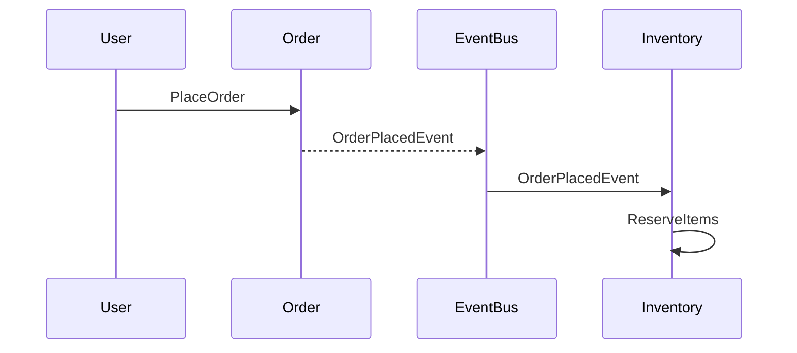

# Guia Rápido: Module Designer Agent

> Como usar o agente `module-designer` para desenhar módulos DDD antes de codar.

---

## Quando usar

✅ **Use o module-designer quando:**
- Iniciar um novo bounded context (ex: Orders, Payments, Shipping)
- Adicionar um aggregate complexo a um módulo existente
- Refatorar um módulo para DDD
- Validar se o design está seguindo DDD corretamente

❌ **NÃO use para:**
- Adicionar um campo simples a uma entidade existente
- Criar um CRUD básico (use feature-builder direto)
- Implementar código (use feature-builder após o design)

---

## Como invocar

### Opção 1: Copilot Chat no IDE

```
@workspace /invoke module-designer

Preciso desenhar um módulo de Orders que gerencia pedidos de clientes.
O pedido tem linhas (produtos + quantidade) e passa por estados (Pending → Confirmed → Shipped → Delivered).
```

### Opção 2: Comment no GitHub

```markdown
/invoke module-designer

## Contexto
Precisamos de um módulo de Pagamentos que:
- Recebe pedidos do módulo Orders
- Processa pagamento com gateway externo
- Publica eventos de sucesso/falha
```

---

## Fluxo de trabalho completo

### 1. Prepare o contexto

Antes de invocar, tenha claro:
- **Propósito:** por que este módulo existe?
- **Responsabilidades:** o que ele faz?
- **Integrações:** com quais outros módulos se comunica?

### 2. Invoque o agente

O agente vai conduzir um **mini Event Storming** fazendo perguntas:

**Perguntas típicas:**
- "Quais eventos acontecem neste contexto?" → `OrderPlacedEvent`, `PaymentProcessed`...
- "O que os usuários fazem?" → `PlaceOrder`, `CancelOrder`...
- "Quais consultas são necessárias?" → `GetOrderById`, `ListOrders`...
- "Quando X acontece, o que deve acontecer automaticamente?" → políticas/event handlers

### 3. Receba o design completo

O agente entrega documento estruturado em `docs/modules/{module}-design.md` com:

```
1. Bounded Context Canvas
2. Aggregates (com invariantes e boundaries)
3. Entidades (propriedades, métodos, factories)
4. Value Objects (validações, imutabilidade)
5. Domain Events (payloads, consumidores)
6. Policies (event handlers)
7. Commands & Queries (lista completa)
8. Estrutura de pastas
9. Checklist de implementação
10. Diagramas (Mermaid)
```

### 4. Revise com o time

**Reunião de revisão (30 min):**
- Tech Lead valida arquitetura
- Domain Expert valida linguagem ubíqua e invariantes
- Time questiona boundaries e dependências

### 5. Aprove e salve

Após aprovação:
```bash
git add docs/modules/{module}-design.md
git commit -m "docs: add {Module} module design"
git push
```

### 6. Implemente

Agora passe o design para o `feature-builder`:

```
@workspace /invoke feature-builder

Implementar o módulo Orders conforme design em:
docs/modules/orders-design.md

Comece pelo aggregate Order e suas entidades.
```

---

## Templates disponíveis

| Arquivo | Uso |
|---------|-----|
| `docs/templates/module-design-template.md` | Template em branco para preencher manualmente |
| `docs/templates/module-design-example-orders.md` | Exemplo completo de módulo desenhado (Orders) |

---

## Exemplo de conversa com o agente

### Input do desenvolvedor:
```
Preciso desenhar um módulo de Inventory que:
- Controla estoque de produtos
- Reserva itens quando um pedido é criado
- Libera itens quando um pedido é cancelado
- Publica eventos quando estoque está baixo
```

### Resposta do agente (resumida):

```markdown
## Event Storming

**Eventos identificados:**
- `InventoryReservedEvent`
- `InventoryReleasedEvent`
- `LowStockDetectedEvent`

**Comandos:**
- `ReserveInventoryCommand`
- `ReleaseInventoryCommand`
- `AdjustStockCommand`

**Queries:**
- `GetProductStockQuery`
- `ListLowStockProductsQuery`

**Policies:**
- `WhenOrderPlacedThenReserveInventory`
- `WhenOrderCancelledThenReleaseInventory`

---

## Aggregate: ProductStock

**Responsabilidade:** Controlar disponibilidade de um produto.

**Invariantes:**
1. QuantityAvailable >= 0
2. QuantityReserved <= QuantityAvailable
3. Não pode reservar mais do que disponível

**Métodos:**
- `Reserve(int quantity)` → dispara `InventoryReservedEvent`
- `Release(int quantity)` → dispara `InventoryReleasedEvent`
- `Adjust(int quantity)` → aumenta/diminui estoque

...
```

---

## Validações automáticas

O agente valida automaticamente:

✅ Aggregates têm invariantes documentados  
✅ Boundaries estão claros (dentro vs fora)  
✅ Events são imutáveis (record)  
✅ Value Objects são imutáveis  
✅ Nenhum aggregate > 5 entidades filhas  
✅ Repositories apenas para aggregate roots  
✅ Commands retornam DTOs (não entidades)

Se algo estiver errado, o agente avisa:

```
⚠️ VALIDAÇÃO FALHOU

Aggregate `Order` tem 8 entidades filhas (máximo recomendado: 5).
Considere dividir em 2 aggregates:
- Order (root + OrderLine)
- OrderShipping (tracking, delivery)
```

---

## Dicas de uso

### 💡 Dica 1: Comece pequeno
Não desenhe um módulo gigante de uma vez. Comece com 1-2 aggregates e expanda iterativamente.

### 💡 Dica 2: Valide invariantes com exemplos
```markdown
**Invariante:** Order deve ter ao menos 1 OrderLine

**Exemplo válido:**
- Order com 1 OrderLine → ✅

**Exemplo inválido:**
- Order com 0 OrderLines → ❌ DomainException
```

### 💡 Dica 3: Desenhe o fluxo de eventos
Use Mermaid para visualizar o event flow:



### 💡 Dica 4: Documente decisões
Use ADRs (Architecture Decision Records) para decisões importantes:

```markdown
### ADR-001: Eventual consistency com Payments

**Decisão:** Usar domain event em vez de chamada síncrona.

**Consequências:**
- ✅ Desacoplamento
- ❌ Latência de alguns segundos
```

---

## Troubleshooting

### Problema: Agente gera aggregate muito grande
**Solução:** Peça explicitamente para dividir:
```
Este aggregate está muito grande. Divida em 2 aggregates separados,
mantendo apenas as entidades mais coesas em cada um.
```

### Problema: Boundaries não estão claros
**Solução:** Peça diagrama visual:
```
Gere um diagrama Mermaid mostrando quais entidades estão dentro e fora
do aggregate Order.
```

### Problema: Invariantes estão vagos
**Solução:** Peça exemplos concretos:
```
Para cada invariante, dê um exemplo válido e um exemplo inválido que
violaria a regra.
```

---

## Checklist pós-design

Antes de implementar, confirme:

- [ ] Bounded Context Canvas preenchido completamente
- [ ] Todos os aggregates têm invariantes explícitos
- [ ] Boundaries documentados (dentro vs fora do aggregate)
- [ ] Domain events nomeados no passado (`*Event`)
- [ ] Value Objects são imutáveis
- [ ] Commands e queries listados
- [ ] Estrutura de pastas definida
- [ ] Diagramas gerados (classes + event flow)
- [ ] Aprovação do tech lead obtida
- [ ] Aprovação do domain expert obtida

---

## Próximos passos

Após design aprovado:

1. **Implementação:**
   ```
   @workspace /invoke feature-builder
   Implementar módulo conforme docs/modules/{module}-design.md
   ```

2. **Revisão:**
   ```
   @workspace /invoke code-reviewer
   Revisar implementação do módulo {Module}
   ```

3. **Validação arquitetural:**
   ```bash
   dotnet test tests/ArchitectureTests/
   ```

---

## Recursos complementares

- **Agent:** `.github/agents/module-designer.agent.md`
- **Instructions:** `.github/instructions/module-design.instructions.md`
- **Template:** `docs/templates/module-design-template.md`
- **Exemplo:** `docs/templates/module-design-example-orders.md`
- **Regras DDD:** `.ai/rules/02-domain.md`

---

## Contato

Dúvidas sobre o agente? Abra issue com label `question` ou `agent:module-designer`.

