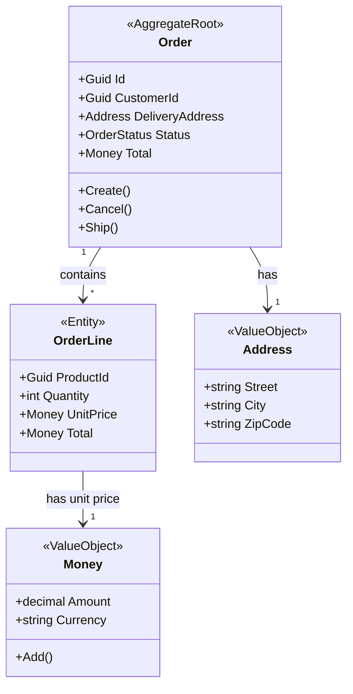
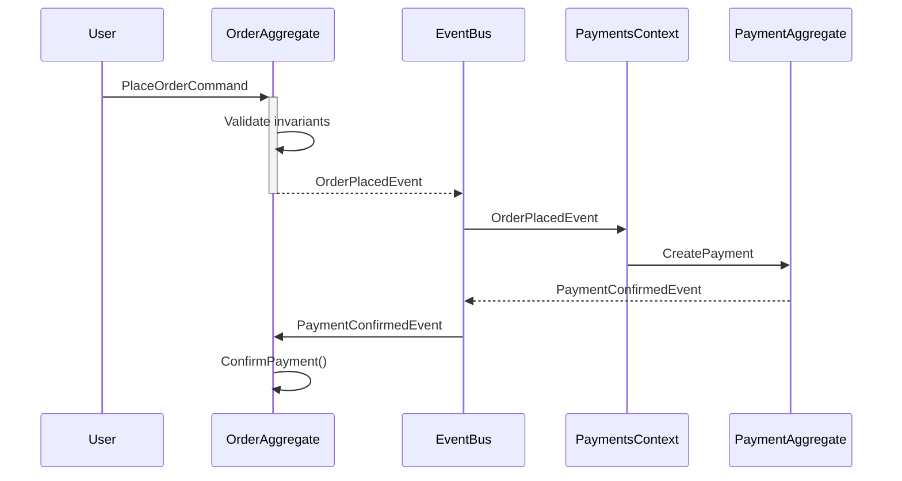

# Module Design: Orders (Exemplo Completo)

> Exemplo de design completo de um módulo DDD usando o template.

**Módulo:** `Orders`  
**Designer:** `Module Designer Agent`  
**Data:** `2026-03-15`  
**Status:** `[x] Aprovado`

---

## 1. Bounded Context Canvas

### Nome do Módulo
`Orders`

### Propósito
Gerenciar o ciclo de vida completo de pedidos de clientes, desde a criação até a entrega, garantindo consistência de estoque e histórico de mudanças de estado.

### Linguagem Ubíqua
| Termo | Significado no contexto |
|-------|------------------------|
| **Order** | Pedido de um cliente contendo produtos e quantidades |
| **OrderLine** | Linha individual do pedido (produto + quantidade + preço) |
| **Place** | Ação de criar e confirmar um pedido |
| **Cancel** | Ação de cancelar um pedido antes do envio |
| **Ship** | Ação de enviar o pedido (mudança para estado `Shipped`) |
| **Deliver** | Ação de marcar como entregue ao cliente |

### Responsabilidades
- [x] Validar disponibilidade de estoque ao criar pedido
- [x] Calcular valor total do pedido
- [x] Rastrear estado do pedido (Pending → Confirmed → Shipped → Delivered)
- [x] Publicar eventos para integração com Inventory e Payments

### Agregados Identificados
- `Order` → aggregate root (controla OrderLines)

### Entidades Identificadas
- `Order` (aggregate root)
- `OrderLine` (entidade filha, parte de Order)

### Value Objects Identificados
- `Money` → valor monetário (amount + currency)
- `Address` → endereço de entrega
- `OrderStatus` → enum de estados

### Dependências de Outros Contextos
| Contexto | Relação | O que consome |
|----------|---------|---------------|
| `Inventory` | Upstream | Consulta disponibilidade via query |
| `Payments` | Downstream | Recebe evento `OrderPlacedEvent` |
| `Identity` | Upstream | Consulta dados do usuário (CustomerId) |

### Eventos Publicados
- `OrderPlacedEvent` → consumido por `Payments` e `Inventory`
- `OrderCancelledEvent` → consumido por `Inventory` (libera estoque)
- `OrderShippedEvent` → consumido por `Notifications` (envia email)

### Eventos Consumidos
- `PaymentConfirmedEvent` de `Payments` → muda status para `Confirmed`
- `InventoryReservedEvent` de `Inventory` → confirma que estoque foi reservado

---

## 2. Aggregates

### 2.1 — Order

#### Aggregate Root
**Entidade:** `Order`

**Responsabilidade:** Gerenciar o ciclo de vida de um pedido e garantir consistência das linhas de pedido.

**Invariantes:**
1. Um pedido deve ter ao menos 1 OrderLine
2. O total do pedido deve ser a soma de todas as OrderLines
3. Um pedido cancelado não pode ser enviado
4. Um pedido entregue não pode ser cancelado
5. Todas as OrderLines devem ter quantidade > 0

#### Entidades Filhas
| Entidade | Relação | Cardinalidade |
|----------|---------|---------------|
| `OrderLine` | Order tem muitas OrderLines | 1:N |

#### Value Objects
| Nome | Propriedades | Validações |
|------|-------------|------------|
| `Money` | `Amount`, `Currency` | Amount >= 0, Currency válida |
| `Address` | `Street`, `City`, `ZipCode`, `Country` | Campos obrigatórios |
| `OrderStatus` | Enum | Apenas transições válidas |

#### Métodos de Domínio
```csharp
// Factory
public static Order Create(Guid customerId, Address deliveryAddress, List<OrderLineData> lines) { }

// Business methods
public void AddLine(Guid productId, int quantity, Money unitPrice) { }
public void RemoveLine(Guid orderLineId) { }
public void Cancel(string reason) { } // dispara OrderCancelledEvent
public void Ship() { } // dispara OrderShippedEvent
public void MarkAsDelivered() { } // dispara OrderDeliveredEvent
public void ConfirmPayment() { } // muda status para Confirmed

// Computed properties
public bool CanBeCancelled => Status is OrderStatus.Pending or OrderStatus.Confirmed;
public bool CanBeShipped => Status == OrderStatus.Confirmed;
public Money CalculateTotal() => OrderLines.Sum(l => l.Total);
```

#### Eventos Disparados
- `OrderPlacedEvent` → quando `Create()` é chamado
- `OrderCancelledEvent` → quando `Cancel()` é chamado
- `OrderShippedEvent` → quando `Ship()` é chamado
- `OrderDeliveredEvent` → quando `MarkAsDelivered()` é chamado

#### Regras de Consistência
- ✅ Garante que total = soma das linhas
- ✅ Garante transições de estado válidas
- ✅ Garante que não há linhas duplicadas (mesmo ProductId)
- ❌ NÃO verifica estoque (responsabilidade do handler + Inventory context)
- ❌ NÃO processa pagamento (responsabilidade do Payments context)

#### Boundaries
**Dentro do aggregate:**
- `Order` (root)
- `OrderLine` (entidade filha)
- `Money` (VO)
- `Address` (VO)

**Fora (referenciado por ID):**
- `Customer` → referenciado por `CustomerId` (Guid)
- `Product` → referenciado por `ProductId` (Guid) em OrderLine

---

## 3. Entidades

### 3.1 — Order

**Tipo:** 
- [x] Aggregate Root

**Implementa:**
- [x] `IMultiTenantEntity`
- [x] `IAuditableEntity`
- [x] `ISoftDeletableEntity`

**Propriedades:**
```csharp
public class Order : AggregateRoot, IMultiTenantEntity
{
    public long TenantId { get; set; }
    public Guid CustomerId { get; private set; }
    public Address DeliveryAddress { get; private set; }
    public OrderStatus Status { get; private set; }
    public string? CancellationReason { get; private set; }
    public DateTime? ShippedAt { get; private set; }
    public DateTime? DeliveredAt { get; private set; }
    
    private readonly List<OrderLine> _orderLines = new();
    public IReadOnlyCollection<OrderLine> OrderLines => _orderLines.AsReadOnly();
    
    public Money Total => CalculateTotal();
    public bool CanBeCancelled => Status is OrderStatus.Pending or OrderStatus.Confirmed;
}
```

**Invariantes:**
1. `OrderLines.Count > 0`
2. `Total == Sum(OrderLines.Total)`
3. `Status` transições válidas: `Pending → Confirmed → Shipped → Delivered`

**Factory Method:**
```csharp
public static Order Create(Guid customerId, Address deliveryAddress, List<OrderLineData> lines)
{
    if (lines.Count == 0)
        throw new DomainException("Order must have at least one line");
    
    var order = new Order
    {
        Id = Guid.NewGuid(),
        CustomerId = customerId,
        DeliveryAddress = deliveryAddress,
        Status = OrderStatus.Pending,
        CreatedAt = DateTime.UtcNow
    };
    
    foreach (var line in lines)
        order.AddLine(line.ProductId, line.Quantity, line.UnitPrice);
    
    order.AddDomainEvent(new OrderPlacedEvent(order.Id, order.Total));
    return order;
}
```

**Métodos de Negócio:**
```csharp
public void Cancel(string reason)
{
    if (!CanBeCancelled)
        throw new DomainException($"Cannot cancel order in status {Status}");
    
    Status = OrderStatus.Cancelled;
    CancellationReason = reason;
    
    AddDomainEvent(new OrderCancelledEvent(Id, reason));
}

public void Ship()
{
    if (!CanBeShipped)
        throw new DomainException($"Cannot ship order in status {Status}");
    
    Status = OrderStatus.Shipped;
    ShippedAt = DateTime.UtcNow;
    
    AddDomainEvent(new OrderShippedEvent(Id, CustomerId));
}
```

### 3.2 — OrderLine

**Tipo:** 
- [ ] Aggregate Root
- [x] Entity (parte de aggregate Order)

**Propriedades:**
```csharp
public class OrderLine : Entity
{
    public Guid OrderId { get; private set; }
    public Guid ProductId { get; private set; }
    public int Quantity { get; private set; }
    public Money UnitPrice { get; private set; }
    public Money Total => Money.Create(UnitPrice.Amount * Quantity, UnitPrice.Currency);
    
    private OrderLine() { }
    
    internal static OrderLine Create(Guid orderId, Guid productId, int quantity, Money unitPrice)
    {
        if (quantity <= 0)
            throw new DomainException("Quantity must be greater than zero");
        
        return new OrderLine
        {
            Id = Guid.NewGuid(),
            OrderId = orderId,
            ProductId = productId,
            Quantity = quantity,
            UnitPrice = unitPrice
        };
    }
}
```

**Invariantes:**
1. `Quantity > 0`
2. `UnitPrice.Amount >= 0`

---

## 4. Value Objects

### 4.1 — Money

**Propósito:** Encapsular valor monetário com currency para evitar mistura de moedas.

**Propriedades:**
```csharp
public record Money
{
    public decimal Amount { get; init; }
    public string Currency { get; init; } = "USD";
    
    private Money() { }
    
    public static Money Create(decimal amount, string currency = "USD")
    {
        if (amount < 0)
            throw new DomainException("Amount cannot be negative");
        
        if (string.IsNullOrWhiteSpace(currency))
            throw new DomainException("Currency is required");
        
        return new Money { Amount = amount, Currency = currency.ToUpperInvariant() };
    }
    
    public Money Add(Money other)
    {
        if (Currency != other.Currency)
            throw new DomainException($"Cannot add {Currency} with {other.Currency}");
        
        return Create(Amount + other.Amount, Currency);
    }
}
```

**Validações:**
1. Amount >= 0
2. Currency não pode ser nulo ou vazio

### 4.2 — Address

**Propósito:** Validar endereço completo de entrega.

**Propriedades:**
```csharp
public record Address
{
    public string Street { get; init; } = string.Empty;
    public string City { get; init; } = string.Empty;
    public string ZipCode { get; init; } = string.Empty;
    public string Country { get; init; } = string.Empty;
    
    private Address() { }
    
    public static Address Create(string street, string city, string zipCode, string country)
    {
        if (string.IsNullOrWhiteSpace(street))
            throw new DomainException("Street is required");
        
        if (string.IsNullOrWhiteSpace(city))
            throw new DomainException("City is required");
        
        return new Address
        {
            Street = street.Trim(),
            City = city.Trim(),
            ZipCode = zipCode.Trim(),
            Country = country.Trim()
        };
    }
}
```

---

## 5. Domain Events

### 5.1 — OrderPlacedEvent

**Quando dispara:** Quando `Order.Create()` é chamado

**Quem dispara:** `Order.Create()`

**Payload:**
```csharp
public sealed record OrderPlacedEvent : IDomainEvent
{
    public Guid OrderId { get; init; }
    public Money Total { get; init; }
    public DateTime OccurredAt { get; init; } = DateTime.UtcNow;
}
```

**Consumidores:**
- `Payments.WhenOrderPlacedThenCreatePayment` → cria cobrança
- `Inventory.WhenOrderPlacedThenReserveItems` → reserva estoque

### 5.2 — OrderCancelledEvent

**Quando dispara:** Quando `Order.Cancel()` é chamado

**Quem dispara:** `Order.Cancel(reason)`

**Payload:**
```csharp
public sealed record OrderCancelledEvent : IDomainEvent
{
    public Guid OrderId { get; init; }
    public string Reason { get; init; } = string.Empty;
    public DateTime OccurredAt { get; init; } = DateTime.UtcNow;
}
```

**Consumidores:**
- `Inventory.WhenOrderCancelledThenReleaseItems` → libera estoque reservado

---

## 6. Policies (Event Handlers)

### 6.1 — WhenPaymentConfirmedThenConfirmOrder

**Tipo:**
- [ ] Domain Policy
- [x] Application Policy (eventual consistency)

**Evento:** `PaymentConfirmedEvent` (de Payments context)

**Ação:** Muda status do pedido para `Confirmed`

**Pseudocódigo:**
```csharp
public class WhenPaymentConfirmedThenConfirmOrderHandler 
    : IDomainEventHandler<PaymentConfirmedEvent>
{
    private readonly IOrderRepository _repo;
    private readonly IUnitOfWork _uow;
    
    public async Task Handle(PaymentConfirmedEvent e, CancellationToken ct)
    {
        var order = await _repo.GetByIdAsync(e.OrderId, ct);
        if (order is null) throw new NotFoundException(nameof(Order), e.OrderId);
        
        order.ConfirmPayment();
        
        await _repo.UpdateAsync(order, ct);
        await _uow.Commit(ct);
    }
}
```

---

## 7. Commands & Queries

### Commands
| Command | Handler | Aggregate | Evento |
|---------|---------|-----------|--------|
| `PlaceOrderCommand` | `PlaceOrderCommandHandler` | `Order` | `OrderPlacedEvent` |
| `CancelOrderCommand` | `CancelOrderCommandHandler` | `Order` | `OrderCancelledEvent` |
| `ShipOrderCommand` | `ShipOrderCommandHandler` | `Order` | `OrderShippedEvent` |

### Queries
| Query | Handler | Retorno |
|-------|---------|---------|
| `GetOrderByIdQuery` | `GetOrderByIdQueryHandler` | `OrderOutput` |
| `ListOrdersByCustomerQuery` | `ListOrdersByCustomerQueryHandler` | `PaginatedListOutput<OrderOutput>` |

---

## 8. Estrutura de Pastas

```
src/Core/Orders/
├── Orders.Domain/
│   ├── Entities/
│   │   ├── Order.cs
│   │   └── OrderLine.cs
│   ├── ValueObjects/
│   │   ├── Money.cs
│   │   ├── Address.cs
│   │   └── OrderStatus.cs
│   ├── Events/
│   │   ├── OrderPlacedEvent.cs
│   │   ├── OrderCancelledEvent.cs
│   │   └── OrderShippedEvent.cs
│   └── Repositories/
│       └── IOrderRepository.cs
├── Orders.Application/
│   ├── Handlers/
│   │   └── Order/
│   │       ├── Commands/
│   │       │   ├── PlaceOrderCommand.cs
│   │       │   ├── CancelOrderCommand.cs
│   │       │   └── ShipOrderCommand.cs
│   │       ├── PlaceOrderCommandHandler.cs
│   │       ├── CancelOrderCommandHandler.cs
│   │       └── ShipOrderCommandHandler.cs
│   ├── Queries/
│   │   └── Order/
│   │       ├── Commands/
│   │       │   ├── GetOrderByIdQuery.cs
│   │       │   └── ListOrdersByCustomerQuery.cs
│   │       ├── GetOrderByIdQueryHandler.cs
│   │       ├── ListOrdersByCustomerQueryHandler.cs
│   │       └── OrderOutput.cs
│   ├── Validators/
│   │   ├── PlaceOrderCommandValidator.cs
│   │   └── CancelOrderCommandValidator.cs
│   └── EventHandlers/
│       └── WhenPaymentConfirmedThenConfirmOrderHandler.cs
└── Orders.Infrastructure/
    └── Data/
        └── Persistence/
            └── OrderRepository.cs
```

---

## 9. Checklist de Implementação

✅ = Completo | ⏳ = Em progresso | ⬜ = Pendente

**Domain:**
- [x] `Order.cs` aggregate root
- [x] `OrderLine.cs` entidade
- [x] `Money.cs` value object
- [x] `Address.cs` value object
- [x] `OrderStatus.cs` enum
- [x] Domain events (3)
- [x] `IOrderRepository.cs`

**Application:**
- [ ] `PlaceOrderCommand` + handler + validator
- [ ] `CancelOrderCommand` + handler + validator
- [ ] `ShipOrderCommand` + handler
- [ ] `GetOrderByIdQuery` + handler
- [ ] `ListOrdersByCustomerQuery` + handler
- [ ] `OrderOutput.cs` DTO
- [ ] Event handler `WhenPaymentConfirmedThenConfirmOrder`

**Infrastructure:**
- [ ] `OrderRepository.cs`
- [ ] `OrderConfigurations.cs` (EF)
- [ ] `OrderLineConfigurations.cs` (EF)
- [ ] Registrar em `DependencyInjection.cs`

**API:**
- [ ] `OrdersController.cs`
- [ ] XML docs
- [ ] Policies: `OrdersRead`, `OrdersManage`
- [ ] Atualizar `RBAC_MATRIX.md`

**Testes:**
- [ ] `OrderTests.cs` (domain logic)
- [ ] `PlaceOrderCommandHandlerTests.cs`
- [ ] `PlaceOrderCommandValidatorTests.cs`
- [ ] Integration tests de endpoints
- [ ] Architecture tests

---

## 10. Diagramas

### Aggregates


### Event Flow


---

## 11. Decisões Arquiteturais

### ADR-001: Order como único aggregate root
**Contexto:** OrderLine poderia ser um aggregate separado ou parte de Order.

**Decisão:** OrderLine é entidade filha de Order (não tem repository próprio).

**Consequências:** 
- ✅ Simplifica consistência (tudo na mesma transação)
- ✅ Garante que total é sempre correto
- ❌ Se um pedido tiver 1000 linhas, pode ficar pesado (mitigado com paginação de leitura)

### ADR-002: Eventual consistency com Payments
**Contexto:** Order precisa saber quando pagamento foi confirmado.

**Decisão:** Usar domain event `PaymentConfirmedEvent` com handler assíncrono.

**Consequências:**
- ✅ Desacopla Orders de Payments
- ✅ Cada contexto tem seu banco independente
- ❌ Pedido fica em `Pending` até o evento chegar (alguns segundos)

---

## Aprovações

- [x] Domain Expert: **DDD Specialist** Data: **2026-03-15**
- [x] Tech Lead: **Senior Developer** Data: **2026-03-15**
- [x] Arquiteto: **Module Designer Agent** Data: **2026-03-15**

