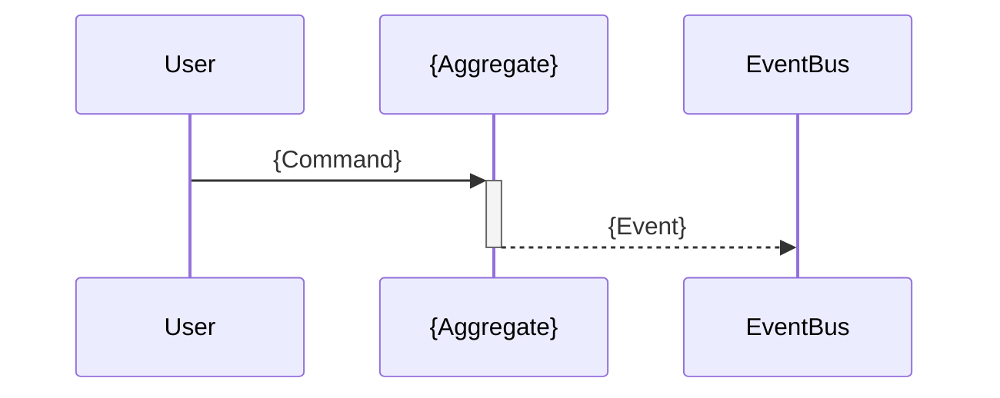

# Module Design Template

> Template em branco para documentar o design de um novo módulo DDD.
> Preencha cada seção antes de iniciar a implementação.

**Módulo:** `{ModuleName}`  
**Designer:** `{Seu Nome}`  
**Data:** `{Data}`  
**Status:** `[ ] Draft` `[ ] Em Revisão` `[ ] Aprovado` `[ ] Implementado`

---

## 1. Bounded Context Canvas

### Nome do Módulo
`{ModuleName}`

### Propósito
{Uma frase que explica por que este contexto existe}

### Linguagem Ubíqua (Ubiquitous Language)
| Termo | Significado no contexto |
|-------|------------------------|
| | |
| | |

### Responsabilidades
- [ ] 
- [ ] 
- [ ] 

### Agregados Identificados
- 
- 

### Entidades Identificadas
- 
- 

### Value Objects Identificados
- 
- 

### Dependências de Outros Contextos
| Contexto | Relação | O que consome |
|----------|---------|---------------|
| | | |

### Eventos Publicados
- 

### Eventos Consumidos
- 

---

## 2. Aggregates

### 2.1 — {AggregateName}

#### Aggregate Root
**Entidade:** `{EntityName}`

**Responsabilidade:** 

**Invariantes:**
1. 
2. 
3. 

#### Entidades Filhas
| Entidade | Relação | Cardinalidade |
|----------|---------|---------------|
| | | |

#### Value Objects
| Nome | Propriedades | Validações |
|------|-------------|------------|
| | | |

#### Métodos de Domínio
```csharp
// Factory
public static {Aggregate} Create({params}) { }

// Business methods
public void {Action1}({params}) { }
public void {Action2}({params}) { }
```

#### Eventos Disparados
- `{Event1}` → quando 
- `{Event2}` → quando 

#### Regras de Consistência
- ✅ 
- ❌ 

#### Boundaries
**Dentro:**
- 

**Fora (referenciado por ID):**
- 

---

## 3. Entidades

### 3.1 — {EntityName}

**Tipo:** 
- [ ] Aggregate Root
- [ ] Entity (parte de aggregate {X})

**Implementa:**
- [x] `IMultiTenantEntity`
- [x] `IAuditableEntity`
- [x] `ISoftDeletableEntity`

**Propriedades:**
```csharp
public class {EntityName} : AggregateRoot, IMultiTenantEntity
{
    public long TenantId { get; set; }
    
    // TODO: adicionar propriedades
}
```

**Invariantes:**
1. 

**Factory Method:**
```csharp
public static {Entity} Create({params})
{
    // TODO: implementar
}
```

**Métodos de Negócio:**
```csharp
public void {Action}({params})
{
    // TODO: implementar
}
```

---

## 4. Value Objects

### 4.1 — {VOName}

**Propósito:** 

**Propriedades:**
```csharp
public record {VOName}
{
    // TODO: adicionar propriedades
    
    public static {VOName} Create({params})
    {
        // TODO: validações
    }
}
```

**Validações:**
1. 

---

## 5. Domain Events

### 5.1 — {EventName}

**Quando dispara:** 

**Quem dispara:** `{Aggregate}.{Method}()`

**Payload:**
```csharp
public sealed record {EventName} : IDomainEvent
{
    public Guid {AggregateId} { get; init; }
    public DateTime OccurredAt { get; init; } = DateTime.UtcNow;
}
```

**Consumidores:**
- 

---

## 6. Policies (Event Handlers)

### 6.1 — When{Event}Then{Action}

**Tipo:**
- [ ] Domain Policy (mesma transação)
- [ ] Application Policy (eventual consistency)

**Evento:** `{EventName}`

**Ação:** 

**Pseudocódigo:**
```csharp
public class When{Event}Then{Action}Handler : IDomainEventHandler<{Event}>
{
    public async Task Handle({Event} e, CancellationToken ct)
    {
        // TODO: implementar
    }
}
```

---

## 7. Commands & Queries

### Commands
| Command | Handler | Aggregate | Evento |
|---------|---------|-----------|--------|
| | | | |

### Queries
| Query | Handler | Retorno |
|-------|---------|---------|
| | | |

---

## 8. Estrutura de Pastas

```
src/Core/{Module}/
├── {Module}.Domain/
│   ├── Entities/
│   ├── ValueObjects/
│   ├── Events/
│   └── Repositories/
├── {Module}.Application/
│   ├── Handlers/
│   ├── Queries/
│   ├── Validators/
│   └── EventHandlers/
└── {Module}.Infrastructure/
    └── Data/
        └── Persistence/
```

---

## 9. Checklist de Implementação

**Domain:**
- [ ] Aggregate root
- [ ] Entidades
- [ ] Value objects
- [ ] Domain events
- [ ] Repository interface

**Application:**
- [ ] Commands
- [ ] Command handlers
- [ ] Validators
- [ ] Queries
- [ ] Query handlers
- [ ] DTOs
- [ ] Event handlers

**Infrastructure:**
- [ ] Repository
- [ ] EF configurations
- [ ] Seeders
- [ ] DI registration

**API:**
- [ ] Controller
- [ ] XML docs
- [ ] RBAC policies
- [ ] RBAC_MATRIX.md

**Testes:**
- [ ] Unit tests
- [ ] Integration tests
- [ ] Architecture tests

---

## 10. Diagramas

### Aggregates
```mermaid
classDiagram
    class {Aggregate} {
        <<AggregateRoot>>
    }
```

### Event Flow


---

## 11. Notas de Revisão

| Data | Revisor | Feedback | Status |
|------|---------|----------|--------|
| | | | |

---

## 12. Decisões Arquiteturais

### ADR-001: {Título}
**Contexto:** 

**Decisão:** 

**Consequências:** 
- ✅ 
- ❌ 

---

## Aprovações

- [ ] Domain Expert: _________________ Data: _______
- [ ] Tech Lead: _________________ Data: _______
- [ ] Arquiteto: _________________ Data: _______

